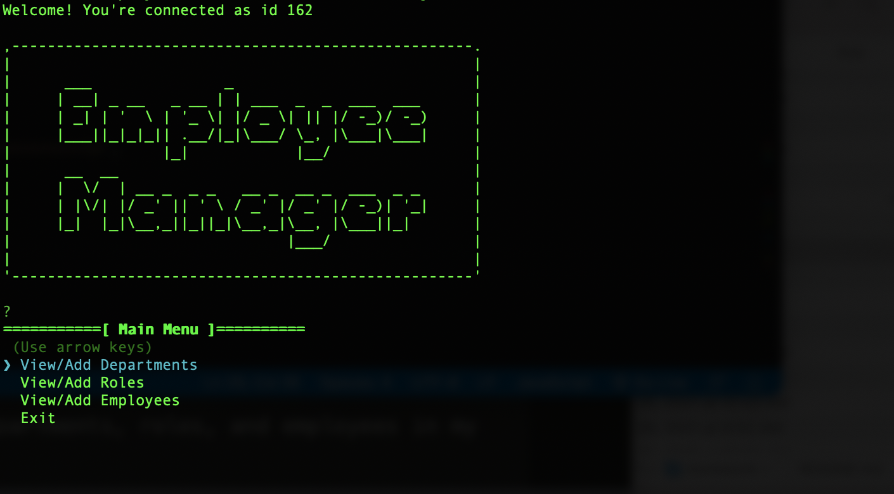

# Employee Tracker

## Description

Employee Tracker is a simple Node CLI app that can be used to manage a company's employees. This application is an interface to a back-end MySQL database to create, retrieve, update, and delete various data.

## Uses

JS/Node/MySQL

## Back-end Librarys

inquirer/mysql

## Installation Instructions

```
npm install
```

## Usagage Information

```
node server.js
```

## Video Walkthrough

coming soon

## Screenshot


